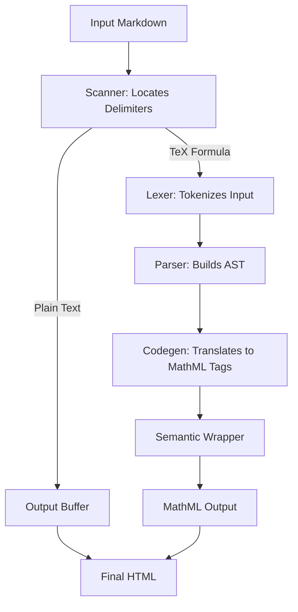
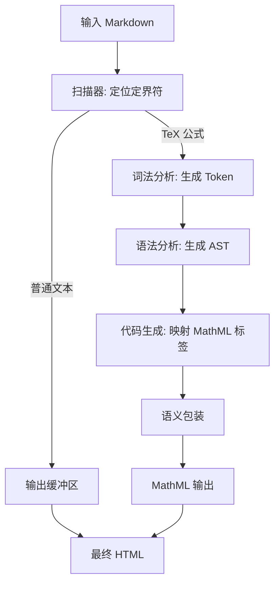

[English](#en) | [中文](#zh)

---

<a id="en"></a>

# @webc.site/math : The world's smallest and fastest web Markdown formula renderer

- [@webc.site/math : The world's smallest and fastest web Markdown formula renderer](#webcsitemath-the-worlds-smallest-and-fastest-web-markdown-formula-renderer)
  - [1. Features](#1-features)
  - [2. Usage](#2-usage)
    - [Compilation Examples](#compilation-examples)
      - [Render TeX Formulas Directly](#render-tex-formulas-directly)
      - [Replace Formulas in Markdown Text](#replace-formulas-in-markdown-text)
    - [Font and CSS Configuration](#font-and-css-configuration)
      - [CSS Font Styling](#css-font-styling)
  - [3. Design](#3-design)
  - [4. Tech Stack](#4-tech-stack)
  - [5. Code Structure](#5-code-structure)
  - [6. Historical Background](#6-historical-background)

## 1. Features

This project compiles LaTeX math formulas into browser-native MathML Core markup, achieving zero-overhead rendering without client-side layout engines.

- **High Performance**: Compiles TeX formulas directly to native MathML. Processing speed reaches 302,000 operations per second, 3.3 times faster than KaTeX and 47 times faster than MathJax.
- **Lightweight**: Package size is 7.69 KB (3.56 KB gzipped), with zero external dependencies.
- **Zero Runtime Dependencies**: Renders math using the browser's native layout engine, eliminating client-side JavaScript formatting libraries.
- **Robust Fault Tolerance**: Catches syntax errors automatically, reverting to raw TeX string output to prevent application crashes.
- **Universal Compatibility**: Generates standard MathML tags suitable for Server-Side Rendering (SSR), Static Site Generation (SSG), and Client-Side Rendering (CSR).

## 2. Usage

### Compilation Examples

#### Render TeX Formulas Directly

```javascript
import mathml from "@webc.site/math";

const html = mathml("e^{i\\pi} + 1 = 0", true); // Second parameter sets block style
```

#### Replace Formulas in Markdown Text

```javascript
import mdMath from "@webc.site/math/md.js";
import compile from "@webc.site/math";

const html = mdMath("Euler's identity: $$e^{i\\pi} + 1 = 0$$", compile);
```

### Font and CSS Configuration

To ensure optimal layout, configure math fonts. Use Latin Modern Math font from the `18s` package.

#### CSS Font Styling

```css
math {
  font-family: m, t, math, sans-serif;
}
```

## 3. Design

The compiler extracts TeX math formulas from input Markdown text, performs lexical and syntax analyses, and generates semantic MathML markup.



## 4. Tech Stack

- **Runtime**: Bun, Node.js
- **Linter & Formatter**: oxlint, oxfmt
- **Build Tool**: Vite, Rolldown, Lightning CSS

## 5. Code Structure

```
.
├── demo/                # Interactive demo page
├── extract/             # Test cases extraction scripts
├── lib/                 # Compiled distribution files
│   ├── mathml.js        # Core compiler (minified)
│   └── md.js            # Markdown math formula parser (minified)
├── src/                 # Source code
│   ├── const/           # Tokens, AST types, symbols and functions constants
│   ├── lex.js           # LaTeX lexer
│   ├── parse.js         # LaTeX parser (AST builder)
│   ├── mathml.js        # Core TeX-to-MathML compiler
│   └── md.js            # Markdown parser entry
├── sh/                  # Scripts
└── test.sh              # Quality verification and test runner
```

## 6. Historical Background

The W3C published the MathML 1.0 specification in 1998 to provide mathematical notation on the web. However, the complexity of the specification placed a heavy implementation burden on browser layout engines.

In 2013, due to maintenance costs and security vulnerabilities, the Chromium team removed the unfinished MathML rendering implementation from the Blink engine. Web developers subsequently relied on client-side JavaScript libraries (such as MathJax and KaTeX) to simulate formula layout. These libraries increased bundle sizes and consumed client-side CPU resources, impacting page load times and rendering performance.

In January 2023, Chrome 109 reintroduced support for the optimized MathML Core specification. With Blink, Gecko, and WebKit all natively supporting this subset, web browsers achieved consistent native MathML rendering. This project compiles TeX directly to native MathML markup at compile time, eliminating client-side layout engines and avoiding client-side rendering overhead.

---

<a id="zh"></a>

# @webc.site/math : 全球最小最快的网页 Markdown 公式渲染器

- [@webc.site/math : 全球最小最快的网页 Markdown 公式渲染器](#webcsitemath-全球最小最快的网页-markdown-公式渲染器)
  - [1. 功能介绍](#1-功能介绍)
  - [2. 使用演示](#2-使用演示)
    - [编译示例](#编译示例)
      - [直接渲染 TeX 公式](#直接渲染-tex-公式)
      - [替换 Markdown 文本中的公式](#替换-markdown-文本中的公式)
    - [字体与 CSS 配置](#字体与-css-配置)
      - [CSS 字体样式设置](#css-字体样式设置)
  - [3. 设计思路](#3-设计思路)
  - [4. 技术栈](#4-技术栈)
  - [5. 代码结构](#5-代码结构)
  - [6. 历史故事](#6-历史故事)

## 1. 功能介绍

项目将 LaTeX 数学公式编译为浏览器原生支持的 MathML Core 标记，无需前端排版引擎，实现零运行开销渲染。

- **高性能**：TeX 公式直接编译为原生 MathML 标签。处理速度达每秒 302,000 次，为 KaTeX 的 3.3 倍，MathJax 的 47 倍。
- **轻量化**：体积 7.69 KB（Gzip 压缩后 3.56 KB），无外部依赖。
- **零运行开销**：完全依赖浏览器原生引擎排版与渲染，无需加载客户端 JavaScript 库。
- **健壮容错**：捕获语法错误（例如未闭合括号），降级输出原始 TeX 字符串，避免崩溃。
- **兼容性**：输出标准 MathML 元素，支持服务端渲染（SSR）、静态网页生成（SSG）和前端动态转换。

## 2. 使用演示

### 编译示例

#### 直接渲染 TeX 公式

```javascript
import mathml from "@webc.site/math";

const html = mathml("e^{i\\pi} + 1 = 0", true); // 第二参数设为 true 表示块级公式
```

#### 替换 Markdown 文本中的公式

```javascript
import mdMath from "@webc.site/math/md.js";
import compile from "@webc.site/math";

const html = mdMath("欧拉恒等式：$$e^{i\\pi} + 1 = 0$$", compile);
```

### 字体与 CSS 配置

配置数学字体以确保排版美观。推荐使用 `18s` 字体包中的 Latin Modern Math 字体。

#### CSS 字体样式设置

```css
math {
  font-family: m, t, math, sans-serif;
}
```

## 3. 设计思路

编译器从输入的 Markdown 文本中提取 TeX 公式，执行词法分析与语法分析，生成对应的语义化 MathML 标记。



## 4. 技术栈

- **运行环境**：Bun, Node.js
- **语法检查与格式化**：oxlint, oxfmt
- **构建工具**：Vite, Rolldown, Lightning CSS

## 5. 代码结构

```
.
├── demo/                # 演示页面
├── extract/             # 测试用例提取脚本
├── lib/                 # 编译产物目录
│   ├── mathml.js        # 核心编译器（压缩版）
│   └── md.js            # Markdown 公式解析器（压缩版）
├── src/                 # 源代码
│   ├── const/           # Token、AST 节点、符号和函数常量定义
│   ├── lex.js           # LaTeX 词法分析器
│   ├── parse.js         # LaTeX 语法分析器
│   ├── mathml.js        # TeX 至 MathML 核心编译器
│   └── md.js            # Markdown 公式解析入口
├── sh/                  # 脚本目录
└── test.sh              # 代码规范与测试运行脚本
```

## 6. 历史故事

MathML 规范制定于 1998 年（W3C 发布 MathML 1.0 规范），旨在为万维网提供数学公式排版标准方案。因规范设计繁杂，给浏览器排版引擎带来实现负担。

2013 年，Chromium 团队因维护成本与安全漏洞考量，移除了 Blink 引擎中的 MathML 渲染代码。网页公式排版转为依赖第三方 JavaScript 库（如 MathJax、KaTeX）模拟公式布局。此类库体积较大，且消耗客户端 CPU 算力，对页面加载和渲染性能产生影响。

2023 年 1 月，Chrome 109 重新支持 MathML Core 标准，Blink、Gecko 和 WebKit 三大主流浏览器引擎实现原生 MathML 渲染支持。此项目在此背景下开发，将 TeX 在构建期或服务端直接编译为原生 MathML 标记，避免客户端排版计算开销。
